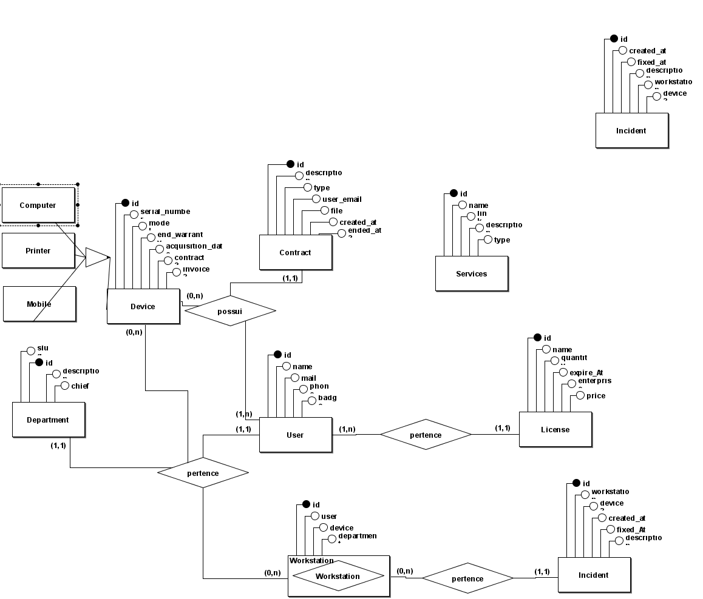

### RF Requisitos Funcionais

- [X] O sistema deve permitir o cadastro de departamentos
- [X] O sistema deve permitir o cadastro de usuários
- [X] O sistema deve permitir o cadastro de licenças (licença, usuários de licença)
  - [X] licença 
  - [X] usuário-licença
- [X] O sistema deve permitir o cadastro de contratos
  - [ ] Enviar arquivo para o servidor
    - [ ] O usuário poderá cadastrar um bucket de arquivos ou salvar localmente
- [X] O sistema deve permitir o cadastro de dispositivos (computador, impressora, dispositivos móveis)
  - [X] computador
  - [X] dispositivos móveis
  - [X] dispositivos genéricos
  - [X] impressoras
- [X] O sistema deve permitir o cadastro de endereços de serviços
- [X] O sistema deve permitir o cadastro de estação de trabalho
- [X] O sistema deve permitir o cadastro de ocorrências
- [ ] O sistema deve permitir a liberação de certos endpoints (recursos) para departamentos selecionados
- [X] O sistema deve permitir o cadastro de contas de emails por departamento
- [ ] O sistema deve permitir o cadastro de contas de emails por usuário para que o sistema envie e-mail por ele

### RN Regras de negócios
- [ ] Os cadastros poderão ser registrados manualmente e/ou através de uma planilha de excel.
- [ ] O sistema deve avisar o/os administradores do sistema caso um contrato ou licença esteja perto do vencimento.
- [ ] O sistema deverá copiar o usuário na mensagem que será enviada por uma conta padrão do sistema.

### RNFs (Requisitos não-funcionais)

- [ ] A autenticação será via código de acesso e/ou magic link;
- [ ] O usuário deve ser identificado por um JWT (Json Web Token);
- [X] Os dados da aplicação precisam estar persistidos em um banco PostgresSQL;

### TODO

- [X] Implementar testes E2E
  - [X] User
  - [X] Computer
  - [X] Contract
  - [X] Department
  - [X] Device
  - [X] Incident
  - [X] License
  - [X] Mobile
  - [X] Printer
  - [X] Service
  - [X] User-License
  - [X] Workstation

- [X] Criar Servidor utilizando Fastify
  - [X] Crud
  - [ ] Monitoramento de servidores
  - [ ] Autenticação

- [ ] Melhorar respostas de erros
- [ ] Implementar Escolha de usuário para onde salvar o arquivo de contrato (local ou r3) [PADRÃO LOCAL]
- [ ] Implementar upload de arquivo de contrato
- [X] Separar schemas de cada controller

### Diagrama Relacional

